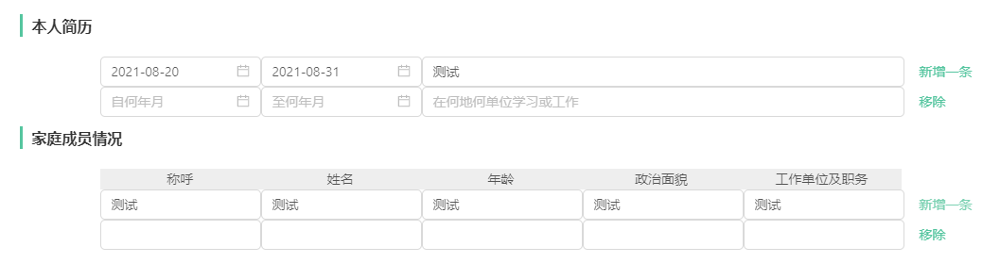

# 新增 移除

效果：
[](https://nodesource.com/products/nsolid)
[](https://nodesource.com/products/nsolid)

## 代码片段

```sh
		<div className={classes.top}>
					<div className={classes.topLeft}>
						<em className={classes.bar}></em>
						<span className={classes.infoText}>本人简历</span>
					</div>
				</div>
				{
					filters.map((item, index) => {
						return (
							<Row gutter={[0, 0]} key={index}>
								<Col span="4" offset={2}>
									<DatePicker placeholder="自何年月" style={ { width: '100%' } } onChange={ (_, dateString) => handleUpdateFilter(filters, index, 'formTime')(dateString) } defaultValue={item.formTime } disabled={isLook}/>
								</Col>
								<Col span="4" >
									<DatePicker placeholder="至何年月" style={{width: '100%'}} onChange={ (_, dateString) => handleUpdateFilter(filters, index, 'toTime')(dateString) } defaultValue={item.toTime } disabled={isLook}/>
								</Col>
								<Col span="12">
									<Input placeholder="在何地何单位学习或工作" onChange={ e => handleUpdateFilter(filters, index, 'location')(e.target.value) } defaultValue={item.location } disabled={isLook}/>
								</Col>
								{
									formStatus !== 'look' && (
										index === 0 && <Col span="1">
											<Button type="link" onClick={() => handleAddFilter(filters)}>新增一条</Button>
										</Col> || ''
									)
								}
								{
									formStatus !== 'look' && (
										index === filters.length - 1 && index !== 0 && <Col span="1">
											<Button type="link" onClick={handleDeleteFilter(filters, index)}>移除</Button>
										</Col> || ''
									)
								}
							</Row>
						)
					})
				}
				<div className={classes.top} style={{marginTop: '10px'}}>
					<div className={classes.topLeft}>
						<em className={classes.bar}></em>
						<span className={classes.infoText}>家庭成员情况</span>
					</div>
				</div>
				<Row>
					<Col offset={2} span={21}>
						<div className={classes.tableHeader}>
							<span>称呼</span>
							<span>姓名</span>
							<span>年龄</span>
							<span>政治面貌</span>
							<span>工作单位及职务</span>
						</div>
					</Col>
				</Row>
				<Row>
					<Col span={24}>
						{
							familyFilters.map((item, index) => {
								return (
									<Row gutter={[0, 0]} key={index}>
										<Col span="4" offset={2}>
											<Input onChange={ (e) => handleUpdateFilter(familyFilters, index, 'callName')(e.target.value) }  defaultValue={item.callName } disabled={isLook}/>
										</Col>
										<Col span="4">
											<Input onChange={ e => handleUpdateFilter(familyFilters, index, 'name')(e.target.value) } defaultValue={item.name } disabled={isLook}/>
										</Col>
										<Col span="4" >
											<Input onChange={ e => handleUpdateFilter(familyFilters, index, 'age')(e.target.value) } defaultValue={item.age } disabled={isLook}/>
										</Col>
										<Col span="4">
											<Input onChange={ e => handleUpdateFilter(familyFilters, index, 'isParty')(e.target.value) } defaultValue={item.isParty } disabled={isLook}/>
										</Col>
										<Col span="4">
											<Input onChange={ e => handleUpdateFilter(familyFilters, index, 'jobTitle')(e.target.value) } defaultValue={item.jobTitle } disabled={isLook}/>
										</Col>
										{
											formStatus !== 'look' && (
												index === 0 && <Col span="1">
													<Button type="link" onClick={() => handleAddFilter(familyFilters)}>新增一条</Button>
												</Col> || ''
											)
										}
										{
											formStatus !== 'look' && (
												index === familyFilters.length - 1 && index !== 0 && <Col span="1">
													<Button type="link" onClick={handleDeleteFilter(familyFilters, index)}>移除</Button>
												</Col> || ''
											)
										}
									</Row>
								)
							})
						}
					</Col>
				</Row>


```

## js(新增)

```sh
/* 添加筛选条件 */
	const handleAddFilter = (type: Array<Record<string, string>>) => {
		if (type === filters) {
			if (filters.some((filter) => filter.formTime === '' || filter.toTime === '' || filter.location === '')) {
				void message.warn('请先填写完毕后再添加')

				return
			}

			setFilters([...filters, { formTime: '', toTime: '', location: '' }])
		}

		if (type === familyFilters) {
			if (
				familyFilters.some(
					(filter) => filter.callName === '' || filter.name === '' || filter.age === '' || filter.isParty === '' || filter.jobTitle === ''
				)
			) {
				void message.warn('请先填写完毕后再添加')

				return
			}

			setFamilyFilters([...familyFilters, { callName: '', name: '', age: '', isParty: '', jobTitle: '' }])
		}
	}
```

## js(删除)

```sh
	/* 删除筛选条件 */
	const handleDeleteFilter = (type: Array<Record<string, string>>, index: number) => () => {
		if (type === filters) {
			setFilters([...type.slice(0, index), ...type.slice(index + 1)])
		}

		if (type === familyFilters) {
			setFamilyFilters([...type.slice(0, index), ...type.slice(index + 1)])
		}
	}

```

[//]: # "These are reference links used in the body of this note and get stripped out when the markdown processor does its job. There is no need to format nicely because it shouldn't be seen. Thanks SO - http://stackoverflow.com/questions/4823468/store-comments-in-markdown-syntax"
[dill]: https://github.com/joemccann/dillinger
[git-repo-url]: https://github.com/joemccann/dillinger.git
[john gruber]: http://daringfireball.net
[df1]: http://daringfireball.net/projects/markdown/
[markdown-it]: https://github.com/markdown-it/markdown-it
[ace editor]: http://ace.ajax.org
[node.js]: http://nodejs.org
[twitter bootstrap]: http://twitter.github.com/bootstrap/
[jquery]: http://jquery.com
[@tjholowaychuk]: http://twitter.com/tjholowaychuk
[express]: http://expressjs.com
[angularjs]: http://angularjs.org
[gulp]: http://gulpjs.com
[pldb]: https://github.com/joemccann/dillinger/tree/master/plugins/dropbox/README.md
[plgh]: https://github.com/joemccann/dillinger/tree/master/plugins/github/README.md
[plgd]: https://github.com/joemccann/dillinger/tree/master/plugins/googledrive/README.md
[plod]: https://github.com/joemccann/dillinger/tree/master/plugins/onedrive/README.md
[plme]: https://github.com/joemccann/dillinger/tree/master/plugins/medium/README.md
[plga]: https://github.com/RahulHP/dillinger/blob/master/plugins/googleanalytics/README.md
