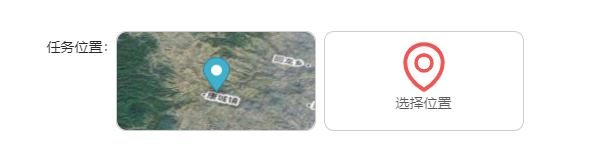

# 天地图+MapboxGL

效果：
[](https://nodesource.com/products/nsolid)
[](https://nodesource.com/products/nsolid)
[](https://nodesource.com/products/nsolid)

## 代码片段

```sh
interface IProps {
	visible: boolean
	setCreateModal: () => void
}

const CreateTask: React.FC = (props: IProps) => {
	const classes = useStyle()
	const [form] = Form.useForm()
	const { setCreateModal, visible } = props

	const [taskMapVis, setTaskMapVis] = useState(false)
	const [mousePoint, setMousePoint] = useState([])
	const [mapCanvas, setMapVanvas] = useState('')
	const [loadVis, setloadVis] = useState(false)

	// 提交
	const postSaveTaskInfoApi = async (values) => {
		setloadVis(true)

		const data = await postSaveTaskInfo(values, mousePoint)

		if (data.error || !data.data) return setloadVis(false)

		if (data.data.code === 200) {
			void message.success('新建成功！')
			setCreateModal(null)
		} else {
			void message.error('系统错误，请稍后再试！')
		}

		setloadVis(false)
	}

	// 选择人员
	const handleSetPerson = (users: Record<string, unknown>[]) => {
		form.setFieldsValue({ bearer: users.map((user) => user.account).join(',') })
	}

	// 上传
	const normFile = (e) => {
		if (Array.isArray(e)) {
			return e
		}

		return e && e.fileList
	}

	// 提交
	const onFinish = (fieldsValue: Record<string, unknown>) => {
		const values: Record<string, unknown> = {
			...fieldsValue,
			// eslint-disable-next-line @typescript-eslint/no-unsafe-call
			stopTime: fieldsValue['stopTime'].format('YYYY-MM-DD HH:mm:ss'),
		}

		if (mousePoint.length === 0) {
			return void message.info('请选择任务位置！')
		} else {
			void postSaveTaskInfoApi(values)
		}
	}

	return (
		<Modal visible={visible} maskClosable={false} closable={false} className={classes.modalStyle}>
			<div className={classes.root}>
				<div className={classes.close}>
					<CloseOutlined onClick={() => setCreateModal(null)} />
				</div>
				<header>
					<h2>临时任务</h2>
				</header>
				<main>
					<Form form={form} name="basic" initialValues={{ remember: true }} onFinish={onFinish}>
						<Form.Item label="任务名称" name="taskName" rules={[{ required: true, message: '不能为空!' }]}>
							<Input />
						</Form.Item>

						<Form.Item label="任务要求" name="taskClaim" rules={[{ required: true, message: '不能为空!' }]}>
							<Input.TextArea rows={5} />
						</Form.Item>

						<Form.Item label="截止时间" name="stopTime" rules={[{ required: true, message: '不能为空!' }]}>
							<DatePicker
								showTime
								format="YYYY-MM-DD HH:mm:ss"
								disabledDate={(current) => {
									return current && current < moment().endOf('day')
								}}
							/>
						</Form.Item>

						<Form.Item label="承担人" name="bearer" rules={[{ required: true, message: '不能为空!' }]}>
							<PersonSelect onSelect={handleSetPerson} />
						</Form.Item>

						{/* eslint-disable */}
						<Form.Item label="任务位置">
							<Space>
								{mousePoint.length > 0 ? (
									<Tooltip title={`经度:${mousePoint[0].toFixed(5)}，纬度:${mousePoint[1].toFixed(5)}`}>
										<div className={clsx(classes.form_point, classes.form_point_ok)} onClick={() => setTaskMapVis(true)}>
											
										</div>
									</Tooltip>
								) : null}

								<div className={clsx(classes.form_point, classes.form_point_choice)} onClick={() => setTaskMapVis(true)}>
									<EnvironmentOutlined />
									<div>选择位置</div>
								</div>
							</Space>
						</Form.Item>
						{/* eslint-disable */}
						<Form.Item name="picture" label="添加图片" valuePropName="fileList" getValueFromEvent={normFile}>
							<Upload
								name="logo"
								beforeUpload={() => false}
								listType="picture"
								accept=".png,.jpg"
								onPreview={async (image) => Zmage.browsing({ src: await getFileBase64(image.originFileObj) })}>
								<Button icon={<CameraOutlined />}></Button>
							</Upload>
						</Form.Item>

						<Form.Item name="annex" label="添加附件" valuePropName="fileList" getValueFromEvent={normFile}>
							<Upload name="logo" beforeUpload={() => false} accept=".pdf,.doc,.docx,.ppt,.pptx,.xls,.xlsx">
								<Button icon={<LinkOutlined />}></Button>
							</Upload>
						</Form.Item>

						<Form.Item>
							<div style={{ textAlign: 'center' }}>
								<Space size="large">
									<Button size="large" className={classes.from_btu} loading={loadVis} type="primary" htmlType="submit">
										确定
									</Button>
									<Button size="large" className={classes.from_btu} onClick={() => setCreateModal(null)}>
										取消
									</Button>
								</Space>
							</div>
						</Form.Item>
					</Form>
				</main>

				{/* 选择地图 */}
				{taskMapVis && (
					<TaskMap
						visible={taskMapVis}
						setVisible={setTaskMapVis}
						setMousePoint={setMousePoint}
						setMapVanvas={setMapVanvas}
						mousePoint={mousePoint}
					/>
				)}
			</div>
		</Modal>
	)
}

export default CreateTask


```

## 地图模块

```sh
import { Modal, Spin } from 'antd'
import React, { useEffect, useState } from 'react'
import { createUseStyles } from 'react-jss'
import MapboxGL from 'mapbox-gl'
import html2canvas from 'html2canvas'
import MapboxGeocoder from '@mapbox/mapbox-gl-geocoder'
import './geocoder.css'
import { getTDTkey } from '../../../utils/map-helper'

MapboxGL.accessToken = 'pk.eyJ1IjoibXJ3YW5nMTIxMiIsImEiOiJjanQ1ZnF2M3QwNXliNDNvN3htMWYyODljIn0.eBdPKjo6n3odkn4thCjCxg'

const useStyle = createUseStyles({
	root: {
		width: '800px !important',
		'& .ant-modal-body': {
			padding: '0 !important',
		},
		'& header': {
			margin: '10px 30px',
		},
	},
	modal_map: {
		width: '100%',
		height: '600px',
	},
})

const TaskMap = (props: any) => {
	const classes = useStyle()

	const [mapSpin, setMapSpin] = useState(true)
	const [mapPointXY, setMapPointXY] = useState([])

	//天地图（各个区域的token可以在网上查到）
	const vecUrl = `http://t0.tianditu.com/img_w/wmts?tk=${getTDTkey()}`
	const cvaUrl = `http://t0.tianditu.com/cva_w/wmts?tk=${getTDTkey()}`

	//实例化source对象
	const tdtVec: any = {
		//类型为栅格瓦片
		type: 'raster',
		tiles: [
			//请求地址
			vecUrl + '&SERVICE=WMTS&REQUEST=GetTile&VERSION=1.0.0&LAYER=img&STYLE=default&TILEMATRIXSET=w&TILEMATRIX={z}&TILEROW={y}&TILECOL={x}&FORMAT=tiles',
		],
		//分辨率
		tileSize: 256,
	}

	const tdtCva: any = {
		type: 'raster',
		tiles: [
			cvaUrl + '&SERVICE=WMTS&REQUEST=GetTile&VERSION=1.0.0&LAYER=cva&STYLE=default&TILEMATRIXSET=w&TILEMATRIX={z}&TILEROW={y}&TILECOL={x}&FORMAT=tiles',
		],
		tileSize: 256,
	}

	/*eslint-disable*/
	useEffect(() => {
		if (props.visible) {
			setTimeout(() => {
				let map = new MapboxGL.Map({
					// style: 'mapbox://styles/mapbox/satellite-v9',
					style: {
						//设置版本号，一定要设置
						version: 8,
						//添加来源
						sources: {
							tdtVec: tdtVec,
							tdtCva: tdtCva,
						},
						layers: [
							{
								//图层id，要保证唯一性
								id: 'tdtVec',
								//图层类型
								type: 'raster',
								//数据源
								source: 'tdtVec',
								//图层最小缩放级数
								minzoom: 0,
								//图层最大缩放级数
								maxzoom: 17,
							},
							{
								id: 'tdtCva',
								type: 'raster',
								source: 'tdtCva',
								minzoom: 0,
								maxzoom: 17,
							},
						],
					},
					center: [111.264616, 36.7525707], //地图中心经纬度
					zoom: 9, //缩放级别
					minZoom: 9,
					maxZoom: 17,
					pitch: 45,
					bearing: -17.6,
					container: 'taskMap',
					preserveDrawingBuffer: true,
				})

				const nav = new MapboxGL.NavigationControl()
				map.addControl(nav, 'bottom-right')
				map.addControl(
					new MapboxGeocoder({
						accessToken: MapboxGL.accessToken,
						mapboxgl: MapboxGL,
					})
				)
				let marker: any = null

				if (props.mousePoint.length > 0) {
					marker = new MapboxGL.Marker({
						draggable: true,
					})
						.setLngLat(props.mousePoint) //添加marker的初始化点
						.addTo(map) //在哪个地图中添加
				}

				map.on('click', (e: any) => {
					const list: any = []
					list.push(e.lngLat.lng)
					list.push(e.lngLat.lat)
					// console.log(e)

					setMapPointXY([e.originalEvent.x, e.originalEvent.y])

					props.setMousePoint([...list])

					if (marker) {
						marker.remove()
					}
					marker = new MapboxGL.Marker({
						draggable: true,
					})
						.setLngLat(list) //添加marker的初始化点
						.addTo(map) //在哪个地图中添加
				})
				setMapSpin(false)
			}, 200)
		}
	}, [props.visible])
	/*eslint-disable*/

	// 取消
	const handleCancel = () => {
		props.setMousePoint([])
		props.setVisible(false)
	}

	// ok
	const handleOk = () => {
		const dom: any = document.querySelector('#taskMap')
		html2canvas(dom, {
			useCORS: true, //允许跨域
			allowTaint: true,
			x: mapPointXY[0] - 100,
			y: mapPointXY[1] - 60,
			width: 200,
			height: 100,
		}).then((canvas: any) => {
			canvas.toBlob((blob) => {
				props.setMapVanvas(URL.createObjectURL(blob))
				// console.log(URL.createObjectURL(blob))
			})
		})
		props.setVisible(false)
	}

	return (
		<Modal className={classes.root} maskClosable={false} title="地图选点" visible={props.visible} onOk={handleOk} onCancel={handleCancel}>
			<Spin tip="地图加载中..." spinning={mapSpin}>
				<div className={classes.modal_map} id="taskMap"></div>
			</Spin>
		</Modal>
	)
}

export default TaskMap

```

[//]: # "These are reference links used in the body of this note and get stripped out when the markdown processor does its job. There is no need to format nicely because it shouldn't be seen. Thanks SO - http://stackoverflow.com/questions/4823468/store-comments-in-markdown-syntax"
[dill]: https://github.com/joemccann/dillinger
[git-repo-url]: https://github.com/joemccann/dillinger.git
[john gruber]: http://daringfireball.net
[df1]: http://daringfireball.net/projects/markdown/
[markdown-it]: https://github.com/markdown-it/markdown-it
[ace editor]: http://ace.ajax.org
[node.js]: http://nodejs.org
[twitter bootstrap]: http://twitter.github.com/bootstrap/
[jquery]: http://jquery.com
[@tjholowaychuk]: http://twitter.com/tjholowaychuk
[express]: http://expressjs.com
[angularjs]: http://angularjs.org
[gulp]: http://gulpjs.com
[pldb]: https://github.com/joemccann/dillinger/tree/master/plugins/dropbox/README.md
[plgh]: https://github.com/joemccann/dillinger/tree/master/plugins/github/README.md
[plgd]: https://github.com/joemccann/dillinger/tree/master/plugins/googledrive/README.md
[plod]: https://github.com/joemccann/dillinger/tree/master/plugins/onedrive/README.md
[plme]: https://github.com/joemccann/dillinger/tree/master/plugins/medium/README.md
[plga]: https://github.com/RahulHP/dillinger/blob/master/plugins/googleanalytics/README.md
