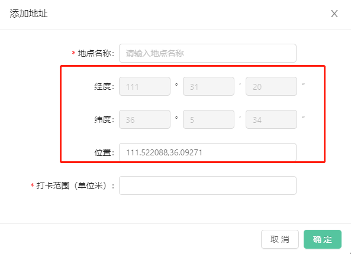
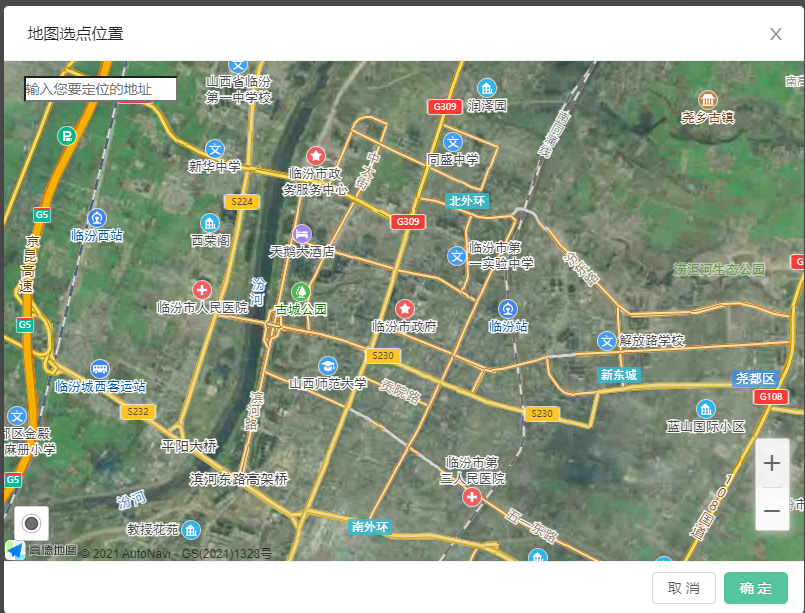

# 新增 移除

效果：
[](https://nodesource.com/products/nsolid)
[](https://nodesource.com/products/nsolid)
[](https://nodesource.com/products/nsolid)

## 代码片段

```sh


import React, { useEffect, useState } from 'react'
import { createUseStyles } from 'react-jss'
import { Modal, Form, Input, InputNumber, Space } from 'antd'
import CheckingMap from './CheckingMap'

const useStyles = createUseStyles({
	root: { width: '600px !important' },
	ModalDiv: {
		'& Input': {
			width: '300px !important',
		},
		'& .ant-input-number': {
			width: '87px',
		},
	},
	root_range: {
		width: '300px !important',
	},
	root_longitude_form: {
		'& .ant-form-item': {
			margin: '0',
		},
	},
})

const layout = {
	labelCol: { span: 8 },
	wrapperCol: { span: 16 },
}

interface IProps {
	visible: boolean
	WorkingPlace: Array<Record<string, unknown>>
	setWorkingPlace: () => void
	setVisible: () => void
}

const ChangeRuleAddPlace: React.FC<IProps> = (props: IProps) => {
	const classes = useStyles()
	const [form] = Form.useForm()
	const [mapSheet, setMapSheet] = useState(false)
	const [mousePoint, setMousePoint] = useState([])
	const [longitudes1, setLongitude1] = useState('')
	const [longitudes2, setLongitude2] = useState('')
	const [longitude3, setLongitude3] = useState('')
	const [latitudes1, setlatitude1] = useState('')
	const [latitudes2, setlatitude2] = useState('')
	const [latitudes3, setlatitude3] = useState('')

	useEffect(() => {
		if (!mousePoint) return

		const value = Math.abs(mousePoint[0])
		const value1 = Math.abs(mousePoint[1])
		const latv1 = Math.floor(value1) //度
		const latv2 = Math.floor((value1 - latv1) * 60) //分
		const latv3 = Math.round(((value1 - latv1) * 3600) % 60) //秒

		const lngv1 = Math.floor(value) //度
		const lngv2 = Math.floor((value - lngv1) * 60) //分
		const lngv3 = Math.round(((value - lngv1) * 3600) % 60) //秒

		if (!latv1 || !latv2 || !latv3 || !lngv1 || !lngv2 || !lngv3) return
		setLongitude1(lngv1)
		setLongitude2(lngv2)
		setLongitude3(lngv3)
		setlatitude1(latv1)
		setlatitude2(latv2)
		setlatitude3(latv3)
	}, [mousePoint])

	useEffect(() => {
		form.setFieldsValue({
			// eslint-disable-next-line use-isnan
			longitude1: longitudes1,
			longitude2: longitudes2,
			longitude3: longitude3,
			latitude1: latitudes1,
			latitude2: latitudes2,
			latitude3: latitudes3,
		})
	})

	/* 提交假期数据 */
	const referRule = (e: Record<string, number>) => {
		const list = props.WorkingPlace

		const values = {
			...e,
			longitude: `${e['longitude1']}°${e['longitude2']}′${e['longitude3']}″`,
			latitude: `${e['latitude1']}°${e['latitude2']}′${e['latitude3']}″`,
		}

		list.push(values)
		props.setWorkingPlace([...list])
		handleCancel()
	}

	/* 关闭模态框 */
	const handleCancel = () => {
		props.setVisible(false)
		setMousePoint([])
		onReset()
	}

	/* 确认加假期 */
	const handleOk = () => {
		form.submit()
	}

	/* 地址添加成功后，清除表单内容 */
	const onReset = () => {
		form.resetFields()
	}

	return (
		<Modal className={classes.root} title="添加地址" maskClosable={false} visible={props.visible} onOk={handleOk} onCancel={handleCancel}>
			<div className={classes.ModalDiv}>
				<Form {...layout} form={form} onFinish={referRule}>
					<div>
						<Form.Item label="地点名称：" name="name" rules={[{ required: true, message: '不能为空！' }]}>
							<Input placeholder="请输入地点名称" />
						</Form.Item>
					</div>
					<div>
						<Form.Item
							label="经度："
							// name="longitude"
							className={classes.root_longitude_form}>
							<Space>
								<Form.Item name="longitude1">
									<InputNumber disabled={true} />
								</Form.Item>
								°
								<Form.Item name="longitude2">
									<InputNumber disabled />
								</Form.Item>
								′
								<Form.Item name="longitude3">
									<InputNumber disabled />
								</Form.Item>
								″
							</Space>
						</Form.Item>
					</div>
					<div>
						<Form.Item
							label="纬度："
							// name="latitude"
							className={classes.root_longitude_form}>
							<Space>
								<Form.Item name="latitude1">
									<InputNumber disabled />
								</Form.Item>
								°
								<Form.Item name="latitude2">
									<InputNumber disabled />
								</Form.Item>
								′
								<Form.Item name="latitude3">
									<InputNumber disabled />
								</Form.Item>
								″
							</Space>
						</Form.Item>
					</div>
					<div>
						<Form.Item label="位置">
							<Input placeholder="请输入位置" onClick={() => setMapSheet(true)} value={mousePoint} />
						</Form.Item>
					</div>
					<div>
						<Form.Item label="打卡范围（单位米）" name="distance" rules={[{ required: true, message: '不能为空！' }]}>
							<InputNumber className={classes.root_range} min={0} />
						</Form.Item>
					</div>
				</Form>
			</div>
			{mapSheet && <CheckingMap visible={mapSheet} setVisible={setMapSheet} mousePoint={mousePoint} setMousePoint={setMousePoint} />}
		</Modal>
	)
}

export default ChangeRuleAddPlace

```

# 地图

```sh
/* eslint-disable @typescript-eslint/no-unsafe-assignment */
/* eslint-disable @typescript-eslint/no-unsafe-call */
/* eslint-disable @typescript-eslint/no-unsafe-member-access */
/**考勤管理地图定位 */
import React, { useEffect } from 'react'
import { Modal } from 'antd'
import { createUseStyles } from 'react-jss'

const useStyle = createUseStyles({
	root: {
		width: '800px !important',
		'& 	.tangram-suggestion-main': {
			zIndex: '999999',
		},
		'& .ant-modal-body': {
			padding: '0 !important',
		},
		'& header': {
			margin: '10px 30px',
		},
	},
	modal_map: {
		width: '100%',
		height: '500px',
	},
})

const CheckingMap: React.FC = (props: any) => {
	const classes = useStyle()

	const handleCancel = () => {
		props.setMousePoint([])
		props.setVisible(false)
	}

	const handleOk = () => {
		props.setVisible(false)
	}

	// useEffect(() => {
	// 	setTimeout(() => {
	// 		map = new window.AMap.Map('container', {
	// 			zoom: 13,
	// 			center: [111.519256, 36.08841],
	// 			layers: [new window.AMap.TileLayer.Satellite(), new window.AMap.TileLayer.RoadNet()],
	// 		})
	// 	})
	// }, [])

	useEffect(() => {
		let map, marker

		setTimeout(() => {
			map = new window.AMap.Map('container', {
				zoom: 13,
				center: [111.519256, 36.08841],

				resizeEnable: true,
				layers: [new window.AMap.TileLayer.Satellite(), new window.AMap.TileLayer.RoadNet()],
			})
			// console.log('====================================')
			// console.log(window)
			// console.log('====================================')
			window.AMap.plugin(['AMap.ToolBar', 'AMap.Geolocation', 'AMap.Autocomplete', 'AMap.PlaceSearch'], function () {
				const autoOptions = {
					input: 'complete_gd', //使用联想输入的input的id
				}

				const autocomplete = new window.AMap.Autocomplete(autoOptions)

				const placeSearch = new window.AMap.PlaceSearch({
					map: map,
				})

				window.AMap.event.addListener(autocomplete, 'select', function (e) {
					//TODO 针对选中的poi实现自己的功能
					placeSearch.search(e.poi.name)
				})

				map.addControl(
					new window.AMap.ToolBar({
						liteStyle: true,
					})
				)
				map.addControl(new window.AMap.Geolocation())
			})

			map.on('click', (e) => {
				if (marker) {
					map.remove(marker)
				}

				// const list = {}

				// list['x'] = e.lnglat.lng
				// list['y'] = e.lnglat.lat
				const list = []

				list.push(e.lnglat.lng)
				list.push(e.lnglat.lat)

				props.setMousePoint([...list])

				marker = new window.AMap.Marker({
					position: list,
				})

				map.add(marker)
			})
		}, 100)

		return () => {
			map.destroy()
		}
		// eslint-disable-next-line react-hooks/exhaustive-deps
	}, [])

	return (
		<Modal title="地图选点位置" visible={props.visible} onCancel={handleCancel} onOk={handleOk} className={classes.root} maskClosable={false}>
			<div className={classes.modal_map} id="container"></div>
			<input id="complete_gd" type="text" placeholder="输入您要定位的地址" style={{ position: 'absolute', left: '20px', top: '70px' }} />
		</Modal>
	)
}

export default CheckingMap

```

[//]: # "These are reference links used in the body of this note and get stripped out when the markdown processor does its job. There is no need to format nicely because it shouldn't be seen. Thanks SO - http://stackoverflow.com/questions/4823468/store-comments-in-markdown-syntax"
[dill]: https://github.com/joemccann/dillinger
[git-repo-url]: https://github.com/joemccann/dillinger.git
[john gruber]: http://daringfireball.net
[df1]: http://daringfireball.net/projects/markdown/
[markdown-it]: https://github.com/markdown-it/markdown-it
[ace editor]: http://ace.ajax.org
[node.js]: http://nodejs.org
[twitter bootstrap]: http://twitter.github.com/bootstrap/
[jquery]: http://jquery.com
[@tjholowaychuk]: http://twitter.com/tjholowaychuk
[express]: http://expressjs.com
[angularjs]: http://angularjs.org
[gulp]: http://gulpjs.com
[pldb]: https://github.com/joemccann/dillinger/tree/master/plugins/dropbox/README.md
[plgh]: https://github.com/joemccann/dillinger/tree/master/plugins/github/README.md
[plgd]: https://github.com/joemccann/dillinger/tree/master/plugins/googledrive/README.md
[plod]: https://github.com/joemccann/dillinger/tree/master/plugins/onedrive/README.md
[plme]: https://github.com/joemccann/dillinger/tree/master/plugins/medium/README.md
[plga]: https://github.com/RahulHP/dillinger/blob/master/plugins/googleanalytics/README.md
